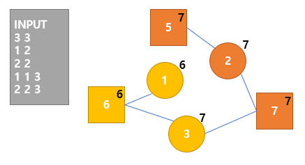

# Baekjoon 1043 거짓말 

<span class="write-date">2020-09-06</span>

[문제 링크](https://www.acmicpc.net/problem/1043)

> 그래프의 연결성을 판단하는 문제

## 기본 아이디어
사람들간의 연결상태를 판단하여 진실을 들은 사람와 연결이 없는 연결요소의 갯수를 세면 됨
> Union-find 이용

## 그래프 구축
* 파티를 하나의 노드로 간주, 그래프를 구축
* 1차적으로 파티에 참석하는 사람들을 파티와 Union 연산  
 
* 모든 노드(사람 + 파티)를 Find 연산 (해당 연산을 통해 모든 연결상태가 구성됨)
* 모든 파티 노드 중에서 진실을 들은 사람 노드와 연결성이 없는 갯수를 세서 출력

## 코드
``` js
let fs = require('fs');
let input = fs.readFileSync('/dev/stdin').toString().split('\n');

const find = (list, x) => {
    if (list[x].parent === list[x].id) {
        return list[x].id;
    } else {
        list[x].parent = find(list, list[x].parent);

        list[x].truth = list[x].truth || list[list[x].parent].truth;
        list[list[x].parent].truth = list[x].truth || list[list[x].parent].truth;

        return list[x].parent;
    }
}

const union = (list, a, b) => {
    const pa = find(list, a);
    const pb = find(list, b);

    if (list[pa].parent !== list[pb].parent) {
        list[pa].parent = list[pb].parent;
    }
};

const NM = input[0].split(' ');
const n = Number(NM[0]);
const m = Number(NM[1]);

const TRUTH = input[1].split(' ');
const t = Number(TRUTH[0]);

const people = [...Array(n + 1)].map((_, i) => {
    let object = {};
    object.id = i;
    object.parent = i;
    object.truth = false;
    return object;
});

if (t !== 0) {
    const knowns = TRUTH.slice(1);
    for (const known of knowns) {
        people[Number(known)].truth = true;
    }
}

for (let i = 2; i < m + 2; i += 1) {
    const raw = input[i].split(' ');
    const _ = Number(raw[0]);
    const list = raw.slice(1);
    const party = {
        id: people.length,
        parent: people.length,
        truth: false,
        // group: list,
    };
    
    people.push(party);
    
    for (const person of list) {
        union(people, Number(person),  party.id);
    }
}

for (const obj of people) {
    find(people, obj.id);
}

// console.log(people.slice(n + 1));
const count = [...people].filter((x, i) => i > n && !x.truth).length
console.log(count);
```