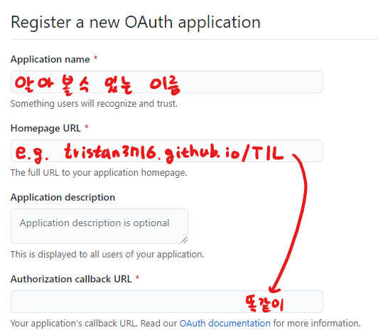
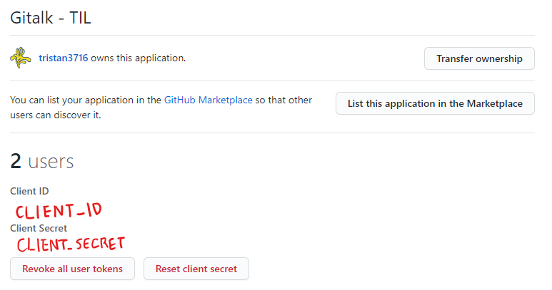

# Setup Gitalk on your Docsify

<span class="write-date">2020-08-26</span>

<p class="indent">
친구가 댓글 기능을 넣은 것을 보고 나도 하고 싶어졌다. 댓글을 위한 여러 라이브러리가 있는데 선택하기 어려워 방황을 많이 했다.
</p>

<p class="indent">
가장 먼저 선택한 라이브러리는 LiveRe City, 카카오톡 소셜로그인을 제공하는 어찌보면 가장 강력한 라이브러리이다. 분명 유용한 기능들을 제공하고 있지만 적용했을 때 너무 불안정하다. Docsify 특유의 DOM 구조와 맞물려 댓글컨테이너가 무한정 로드되는 버그가 빈번하게 발생하고, 로딩이 너무 느려서 사용을 포기했다.
</p>

<p class="indent">
그 외에 disqus, utterances, Gitalk 등이 있었는데, 그 중에서 Gitalk을 선택하여 적용하였다. 기능 자체는 utterances와 유사하지만 디자인이 마음에 안들어서 바꾸기 귀찮았다.
</p>

## 🔗 CDN

<p class="indent">
이 글을 읽는 사람의 Docsify가 hash모드에서 돌아간다고 가정하고 설치법을 기술한다.
</p>

``` html
<link rel="stylesheet" href="https://cdn.jsdelivr.net/npm/gitalk@1/dist/gitalk.css">
<script src="https://cdn.jsdelivr.net/npm/gitalk/dist/gitalk.min.js"></script>
```

<p class="indent">
두개의 cdn 태그를 넣어주면 설치가 끝난다.
</p>

## 🔒 Github OAuth
우선, [Github New OAuth Apps](https://github.com/settings/applications/new)에 접속하여 OAuth를 등록해야한다.



등록이 완료되면 다음과 같은 화면을 확인할 수 있고, CLIENT_ID와 CLIENT_SECRET을 확인하여 댓글 컨테이너 생성 옵션에 추가하면 된다.



<br>

## ⚙️ docsify setting

``` js
window.$docsify = {
    plugins: [
        function (hook, vm) {
            hook.mounted(function() {
                const div = Docsify.dom.create('div');
                div.id = 'gitalk-container';
                const main = Docsify.dom.getNode('#main');
                Docsify.dom.appendTo(Docsify.dom.find('.content'), div);
            });

            hook.doneEach(function() {
                const el = document.getElementById('gitalk-container');
                while (el.hasChildNodes()) {
                    el.removeChild(el.firstChild);
                }

                const path = /^.*?#(\/.*?)(?:\?.*|)$/g.exec(location.href)[1];
                const gitalk = new Gitalk({
                    clientID: CLIENT_ID,
                    clientSecret: CLIENT_SECRET,
                    id: path,
                    repo: 'TIL',
                    owner: 'tristan3716',
                    admin: ['tristan3716'],
                    title: path,
                });

                gitalk.render('gitalk-container');
            })
        }
    ],
}
```

<p class="indent">
index.html의 window.$docsify에 위의 내용을 추가한다. 이때, id는 페이지별로 댓글을 구분할 ID, title은 이슈의 제목이 된다.
</p>

<p class="indent">
path를 생성하는 정규식은 주소(http://tristan3716.github.io/TIL/#<strong style="color: red;">/Others/gitalk</strong>?id=install)의 <code>/Others/gitalk</code>에 해당하는 영역이 되고, 이 ID가 라벨로 등록된다. 이슈 라벨이 50글자로 제한되어 있어서 필요하다면 추가로 slice하거나 하는 등의 조치가 필요하다.
</p>