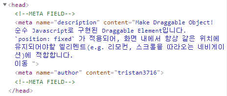

# 20-08-28

## 알고리즘
### [Baekjoon 1759 암호만들기](/Algorithm/Baekjoon/p1759)
재귀를 이용하여 가능한 모든 조합을 출력하고, 중간중간 불가능한 경우(자음, 모음의 개수)를 커팅

### 재귀식 조합 생성 코드
``` java
public void makeCombinationRecursive(final char[] src, final int r) {
    makeCombinationRecursive(src, new char[r], 0, r, 0, src.length);
}

private void makeCombinationRecursive(final char[] src, char[] res, final int start, final int r, int current, final int max) {
    if (r == current) {
        // DO SOMETHING HERE
    } else {
        for (int i = start; i < max; ++i) {
            res[current] = src[i];
            makeCombinationRecursive(src, res, i + 1, r, current + 1, max);
        }
    }
}
```

## Docsify-meta

Docsify metadatas generator



[desciption](/Others/docsify-meta)

[github](https://github.com/tristan3716/docsify-meta)